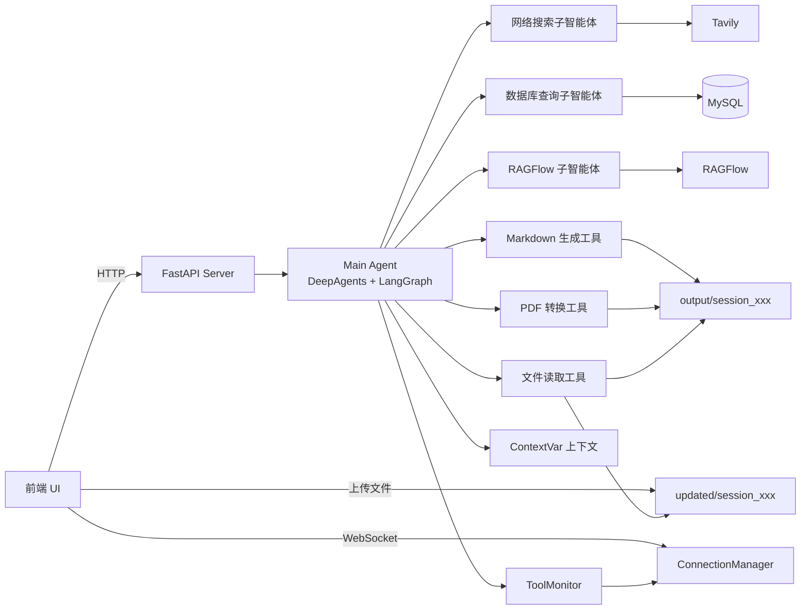

# XDeepSearch

一个面向复杂业务问题的多智能体检索与文档生成项目，整体采用 FastAPI + DeepAgents/LangGraph + 多数据源工具集成的架构，支持：

- 公开网络信息检索
- 企业数据库查询
- RAGFlow 知识库问答
- 用户上传文件解析
- Markdown / PDF 文档生成
- WebSocket 实时进度回传

---

## 1. 项目定位

该项目本质上是一个“大模型任务编排后端”。

系统接收用户问题后，由主智能体统一调度多个子智能体和工具，从不同来源收集信息，再根据用户要求输出文本结果或生成报告文件。

适用场景包括：

- 企业知识问答
- 行业资料调研
- 商品/药品数据分析
- 基于多源信息的报告生成
- 上传资料后的定向分析

---

## 2. 项目结构

```text
XDeepSearch/
├─ agent/                  # 主智能体、模型初始化、提示词加载、子智能体定义
│  ├─ subagents/
├─ api/                    # FastAPI 服务入口、WebSocket 管理、上下文隔离
├─ output/                 # 任务输出目录，按 session 隔离
├─ prompt/                 # YAML 提示词配置
├─ rawflow/                # RAGFlow 配置与示例
├─ tools/                  # 数据库、搜索、RAG、文件处理、文档生成工具
├─ updated/                # 用户上传文件目录，按 session 隔离
├─ utils/                  # 路径解析、Word/PDF 转换等工具
├─ .env                    # 外部服务配置
└─ requirements.txt        # Python 依赖
```

---

## 3. 核心架构



### 3.1 架构分层

#### 接口层

- `api/server.py` 提供 HTTP 接口与 WebSocket 接口
- 负责接收任务、上传文件、列出输出文件、下载文件
- 使用 `asyncio.create_task()` 启动异步任务，不阻塞 API 主线程

#### 编排层

- `agent/main_agent.py` 是任务调度核心
- 使用 `create_deep_agent()` 构建主智能体
- 统一管理模型、工具、子智能体和流式执行

#### 能力层

- 网络搜索子智能体：调用 Tavily 搜索公开信息
- 数据库子智能体：调用 MySQL 查询业务数据
- RAGFlow 子智能体：查询企业内部知识库
- 文件工具：读取上传文件和输出文件
- 文档工具：生成 Markdown 并转换为 PDF

#### 运行时支撑层

- `api/context.py`：基于 `ContextVar` 做请求级上下文隔离
- `api/monitor.py`：向前端实时推送工具调用、任务进度和结果
- `utils/path_utils.py`：统一处理会话内路径解析和路径隔离

---

## 4. 核心执行流程

```mermaid
flowchart TD
    A[前端建立 WebSocket 连接] --> B[POST /api/task 提交任务]
    A --> A1[POST /api/upload 上传文件]
    A1 --> A2[updated/session_{thread_id}]
    B --> C[FastAPI create_task run_deep_agent]
    C --> D[创建 output/session_{thread_id}]
    D --> E[复制上传文件到工作目录]
    E --> F[设置 session_dir/thread_id 上下文]
    F --> G[main_agent.astream 流式执行]
    G --> H{模型决策}
    H -->|公开知识| I[网络搜索子智能体]
    H -->|业务数据| J[数据库查询子智能体]
    H -->|内部知识| K[RAGFlow 子智能体]
    I --> L[返回检索结果]
    J --> L
    K --> L
    L --> G
    H -->|需要生成文件| M[generate_markdown]
    M --> N[convert_md_to_pdf]
    G --> O[monitor 推送进度事件]
    O --> P[WebSocket 回传前端]
    N --> Q[结果输出到 output/session_{thread_id}]
    Q --> R[GET /api/files 查看文件]
    R --> S[GET /api/download 下载文件]
```

### 4.1 详细步骤说明

1. 前端先建立 `ws/{thread_id}` 长连接，用于接收任务执行过程中的实时消息。
2. 如果用户上传了文件，文件会保存到 `updated/session_{thread_id}`。
3. 前端发起 `POST /api/task`，提交问题和可选的 `thread_id`。
4. 服务端异步启动 `run_deep_agent(query, thread_id)`。
5. 主智能体创建 `output/session_{thread_id}` 作为当前任务工作目录。
6. 如果发现存在上传文件，则复制到输出目录，并通过额外提示词告知模型优先读取这些文件。
7. 任务上下文通过 `ContextVar` 保存当前会话目录和线程 ID，避免多请求串台。
8. 主智能体开始流式执行，根据任务内容选择调用：
   - 网络搜索助手
   - 数据库查询助手
   - RAGFlow 助手
   - 文件读取工具
   - Markdown/PDF 生成工具
9. 所有工具和子智能体调用过程会通过 `monitor` 推送给前端。
10. 如果生成了文件，文件落在 `output/session_{thread_id}` 下。
11. 前端通过 `/api/files` 查询文件列表，再通过 `/api/download` 下载结果文件。

---

## 5. 主智能体设计

主智能体定义于 `agent/main_agent.py`，负责：

- 接收用户原始问题
- 拼接运行时工作目录指令
- 调度子智能体和工具
- 流式解析模型输出
- 上报进度与结果
- 清理会话上下文

### 5.1 主智能体挂载内容

- 模型：`agent/llm.py`
- 工具：
  - `generate_markdown`
  - `convert_md_to_pdf`
  - `read_file_content`
- 子智能体：
  - `database_query_agent`
  - `network_search_agent`
  - `knowledge_base_agent`

### 5.2 任务上下文设计

系统在每次执行任务时都会创建会话级目录，并将以下信息写入上下文：

- `session_dir`：当前任务的输出目录
- `thread_id`：当前任务对应的会话标识

这样深层工具无需显式传参，也能知道当前任务属于哪个用户会话。

---

## 6. 子智能体设计

### 6.1 网络搜索子智能体

文件：`agent/subagents/network_search_agent.py`

职责：

- 面向互联网公开信息
- 适合行业背景、政策、公开新闻、通用知识搜索

底层工具：

- `tools/tavily_tool.py -> internet_search`

### 6.2 数据库查询子智能体

文件：`agent/subagents/database_query_agent.py`

职责：

- 面向企业业务数据库
- 查询表结构、表数据和复杂 SQL 结果

底层工具：

- `list_sql_tables`
- `get_table_data`
- `execute_sql_query`

### 6.3 RAGFlow 子智能体

文件：`agent/subagents/knowledge_base_agent.py`

职责：

- 面向企业内部知识库
- 先获取可用助手列表，再向指定助手发起提问

底层工具：

- `get_assistant_list`
- `create_ask_delete`

---

## 7. 工具层说明

### 7.1 检索类工具

#### Tavily 网络搜索

- 文件：`tools/tavily_tool.py`
- 功能：搜索公开互联网信息
- 外部依赖：`TAVILY_API_KEY`

#### RAGFlow 查询

- 文件：`tools/ragflow_tools.py`
- 功能：
  - 获取 RAGFlow 可用聊天助手
  - 建立临时会话并提问
- 外部依赖：
  - `RAGFLOW_API_URL`
  - `RAGFLOW_API_KEY`

#### MySQL 查询

- 文件：`tools/db_tools.py`
- 功能：
  - 列出所有表
  - 预览表数据
  - 执行自定义 SQL
- 外部依赖：
  - `MYSQL_HOST`
  - `MYSQL_PORT`
  - `MYSQL_USER`
  - `MYSQL_PASSWORD`
  - `MYSQL_DATABASE`

### 7.2 文件类工具

#### 文件读取工具

- 文件：`tools/upload_file_read_tool.py`
- 支持格式：
  - `.md`
  - `.txt`
  - `.docx`
  - `.pdf`
  - `.xlsx`
  - `.xls`

#### Markdown 生成工具

- 文件：`tools/markdown_tools.py`
- 功能：根据模型整理后的内容生成 Markdown 文件

#### PDF 转换工具

- 文件：`tools/pdf_tools.py`
- 功能：将 Markdown 通过 Word 引擎转换为 PDF
- 依赖：本地 Windows + Microsoft Word + `pywin32`

---

## 8. 提示词配置

提示词位于 `prompt/prompts.yml`，包含：

- 主智能体系统提示词
- 网络搜索子智能体提示词
- 数据库查询子智能体提示词
- RAGFlow 子智能体提示词

当前提示词策略强调：

- 先检索，后生成
- 不允许先生成占位文档
- 生成 PDF 时必须先生成 Markdown
- 输出内容要尽可能完整丰富
- 检索任务与生成任务要分步骤执行

---

## 9. API 接口说明

### 9.1 启动任务

**接口**

```http
POST /api/task
Content-Type: application/json
```

**请求体**

```json
{
  "query": "请调研某药品市场情况并生成报告",
  "thread_id": "optional-thread-id"
}
```

**返回**

```json
{
  "status": "started",
  "thread_id": "xxx"
}
```

### 9.2 上传文件

**接口**

```http
POST /api/upload
Content-Type: multipart/form-data
```

**表单字段**

- `files`: 一个或多个文件
- `thread_id`: 当前任务会话 ID

### 9.3 获取输出文件列表

**接口**

```http
GET /api/files?path=输出目录绝对路径
```

### 9.4 下载文件

**接口**

```http
GET /api/download?path=文件绝对路径
```

### 9.5 WebSocket 实时回传

**接口**

```text
ws://host:port/ws/{thread_id}
```

消息类型包括：

- `session_created`
- `tool_start`
- `assistant_call`
- `task_result`
- `error`
- `pong`

---

## 10. 配置说明

项目通过 `.env` 管理外部服务配置，关键字段如下：

```env
RAGFLOW_API_URL=http://your-ragflow-host
RAGFLOW_API_KEY=your-ragflow-api-key

OPENAI_BASE_URL=https://dashscope.aliyuncs.com/compatible-mode/v1
OPENAI_API_KEY=your-openai-compatible-key
LLM_QWEN_MAX=qwen-max

TAVILY_API_KEY=your-tavily-key

MYSQL_USER=root
MYSQL_PASSWORD=root
MYSQL_DATABASE=pharma_db
MYSQL_HOST=localhost
MYSQL_PORT=3306
```

---

## 11. 启动方式

### 11.1 安装依赖

```bash
pip install -r requirements.txt
```

### 11.2 启动服务

```bash
uvicorn api.server:app --host 0.0.0.0 --port 8000 --reload
```

### 11.3 推荐调用顺序

1. 前端生成或约定 `thread_id`
2. 连接 `WebSocket /ws/{thread_id}`
3. 如果有附件，先调用 `/api/upload`
4. 调用 `/api/task`
5. 监听 WebSocket 进度消息
6. 任务完成后调用 `/api/files`
7. 调用 `/api/download` 下载结果文件

---

## 12. 关键设计亮点

### 12.1 会话隔离

每个任务都有独立的：

- WebSocket 通道
- 输出目录
- 上传目录
- 运行时上下文

这使得系统可以同时处理多个用户任务，并避免串台。

### 12.2 多源信息融合

系统将信息源分为三类：

- 公开网络信息
- 企业结构化数据库
- 企业非结构化知识库

这种设计适合复杂企业级分析任务。

### 12.3 流式进度可视化

工具调用、子智能体调用和最终结果都能被推送给前端，便于用户感知任务执行过程。

### 12.4 文件型任务支持

不仅能输出文本回答，还能生成 Markdown / PDF 文档，并支持对用户上传资料做二次分析。

---

## 13. 当前已知问题与改进建议

### 13.1 SQL 安全性风险

`execute_sql_query` 直接执行模型生成 SQL，存在较高风险：

- 缺少只读限制
- 缺少 SQL 白名单
- 缺少危险语句拦截
- 缺少表名/字段名约束

建议：

- 仅允许 `SELECT`
- 增加 SQL 解析与审计
- 屏蔽 `UPDATE/DELETE/INSERT/ALTER/DROP`

### 13.2 表名拼接风险

`get_table_data(table_name)` 直接拼接表名，应增加合法性校验。

### 13.3 日志输出较随意

部分模块在导入时直接 `print`，会污染生产日志，建议改为统一日志系统。

### 13.4 路径工具可维护性一般

`utils/path_utils.py` 顶部存在重复代码痕迹，建议清理重构。

### 13.5 PDF 转换依赖本地 Word

当前 PDF 能力依赖 Windows + Microsoft Word，不利于 Linux 容器化部署。

建议：

- 增加纯 Python 或浏览器引擎方案
- 例如 WeasyPrint / Playwright / wkhtmltopdf

---

## 14. 适合的后续演进方向

- 增加前端页面和可视化任务面板
- 增加任务历史与持久化存储
- 增加用户鉴权和多租户隔离
- 增加数据库访问权限控制
- 增加更细粒度的工具监控和日志审计
- 增加测试用例和集成测试
- 增加 Docker 化部署方案

---

## 15. 总结

`XDeepSearch` 是一个典型的多智能体企业应用后端雏形，已经具备以下关键能力：

- 基于主智能体的任务编排
- 多检索源协同工作
- 文件上传与文件输出
- 会话级上下文隔离
- WebSocket 实时进度反馈

如果继续完善前端、权限、安全控制和部署能力，它可以进一步演进为一个可用于真实业务场景的智能分析与报告生成平台。
